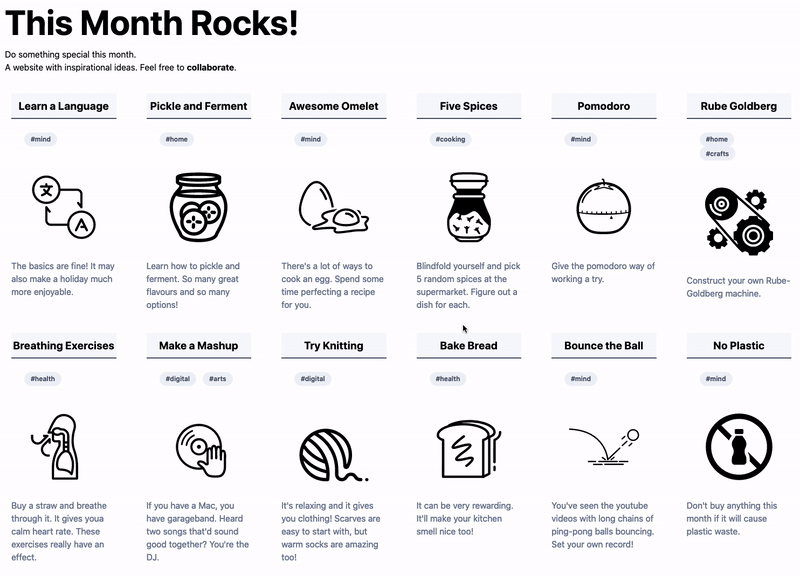
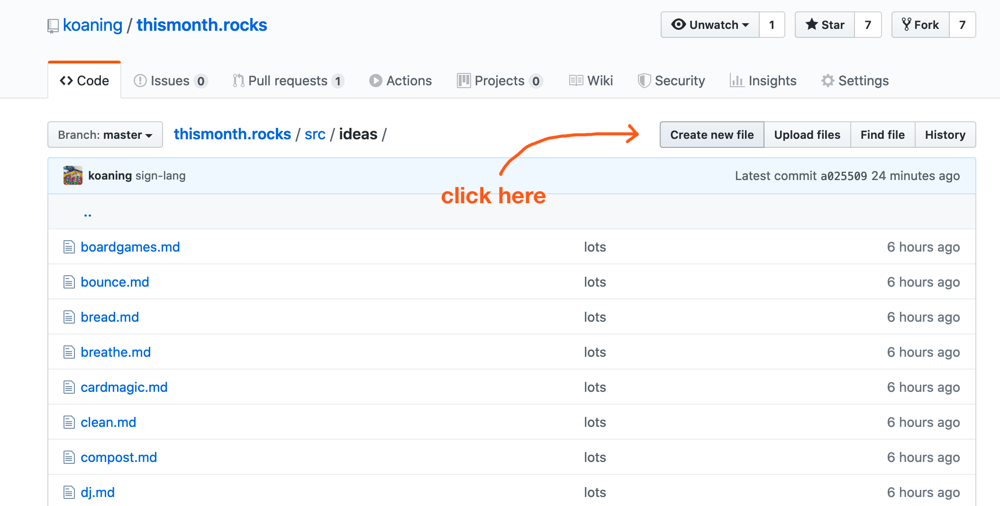
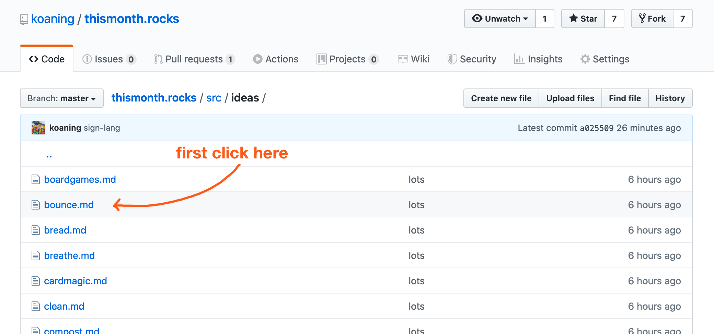
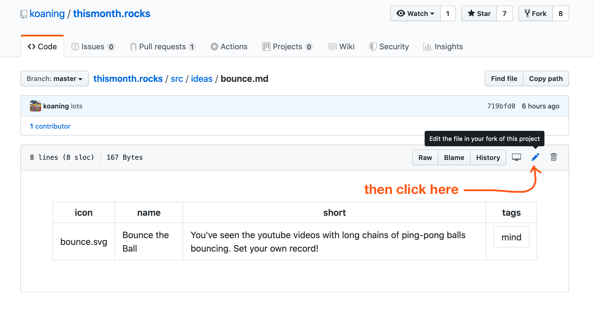
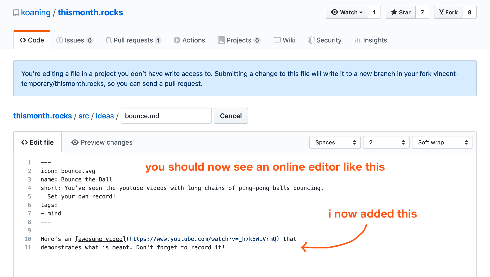
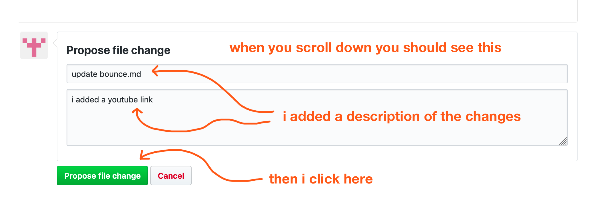
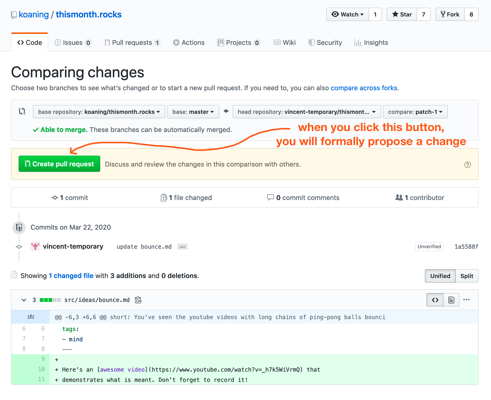
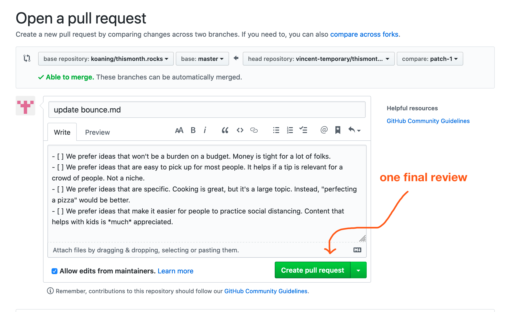
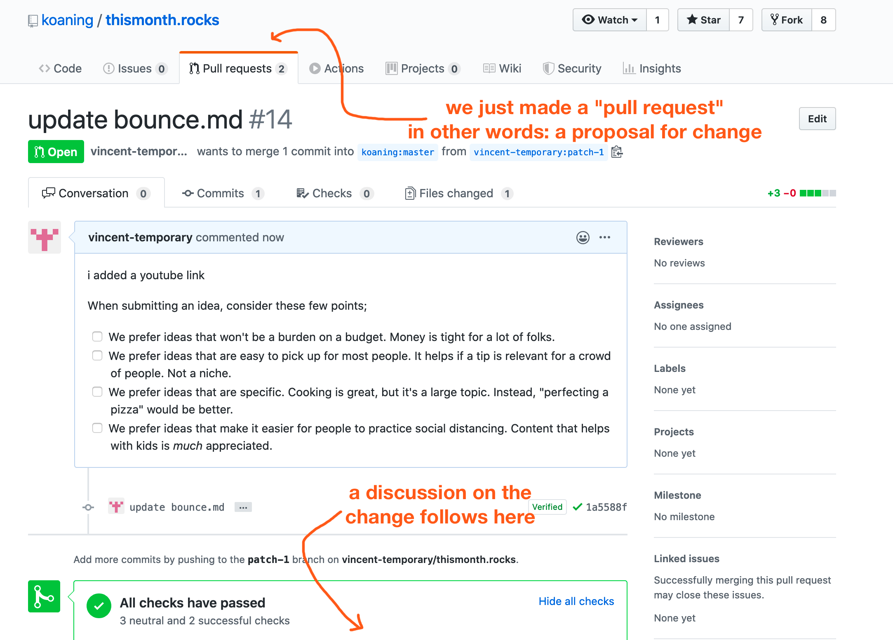

# thismonth.rocks

A collaborative motivational website to encourage you to do something special this month.



## API 

The website exposes the ideas as a json blob. You can see it [here](https://thismonth.rocks/tips.json) or download it via; 

```
wget https://thismonth.rocks/tips.json
```

## How To Contribute A New Idea

If you want to contribute, feel free to add a file to the `src/ideas` folder and add a PR. The icons will be handled by the maintainer and are retreived from [the nounproject](https://thenounproject.com/). 

When submitting an idea, consider these few points; 

- It's the little things that matter.
- We prefer ideas that won't be a burden on a budget. Money is tight for a lot of folks. 
- We prefer ideas that are easy to pick up for most people. It helps if a tip is relevant for a crowd of people. Not a niche. 
- We prefer ideas that are specific. Cooking is great, but it's a large topic. Instead, "perfecting a pizza" would be better. 
- We prefer ideas that make it easier for people to practice social distancing. Content that helps with kids is *much* appreciated. 

This project is also an experiment. Feel free to discuss cool ideas in the issue list as well.

## How To Add an Appendix

If you want to contribute, feel free to update a file in the `src/ideas` folder and add a PR. 

When giving context, consider these few points; 

- Mobile phones have limited screen real estate. Best keep it short.
- It would be great if we can support local businesses who are hit hard by the pandemic. Adding something like "If possible, consider buying the book from a local book-store." goes a long way. 
- Don't overdo it. Just give short meaningful places where folks can find out more when they're inspired. 
- We're here to inspire, not to do marketing or sales pitches. 

## New to Github? 

There's a small tutorial below but we've also made [a video](https://vimeo.com/399993277).

If you're logged into a github account then these are the steps that you need to follow. 

First you need to navigate to `thismonth.rocks/src/ideas`. You should see a screenshot like below. You can create a new file if you want to add a card to the webpage.



But you can also make a change to a card. Say add a desription. In that case ... 



And then ... 



#### The Editor

Either way, you should now see something of an editor. I've added some text to the document that I saw before.



After you've created the changes you'd like to create you can scroll down and click the green button. 



#### It's called a PR (Pull Request)

You should now see a screen that looks like this; 



This screen looks intimidating, but for now we'll ignore everything except the green button. After clicking it, we need to click it one more time. 



#### We Made a Request! 

You just added a "pull request". This means that the maintainer of the project can now have a look at it and consider if the change is good for the project.



The idea is that your change is now "in review" once it is deemed good enough, it will be "merged" into the project. 

You can actually see the pull request [here](https://github.com/koaning/thismonth.rocks/pull/14).